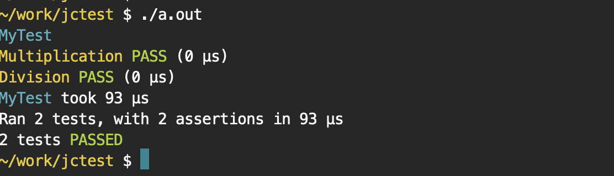

# jctest

A tiny C/C++ header only test framework

## About

This library came about as a test to see if it was possible to write a small and fast replacement
for the one I was already using (gtest).

As it turns out, it was perfectly doable, and here is the result.

## Usage

[test_example.cpp](../examples/test_example.cpp) :
```C++
#define JC_TEST_IMPLEMENTATION
#include <jc_test.h>

TEST(MyTest, Multiplication) {
    ASSERT_EQ(4, 2 * 2);
}

TEST(MyTest, Division) {
    ASSERT_EQ(2, 4 / 2);
}

int main(int argc, char *argv[]) {
    jc_test_init(&argc, argv);
    // ... Do your test initialization
    return JC_TEST_RUN_ALL();
}
```

    # Compile the test
    $ clang++ -Isrc ./examples/test_example.cpp
    
    # Run the test
    $ ./a.out



You can find more examples in the API documentation and also under the ./test/ folder

## API


## Goals

* Replacement for googletest, with minimal changes
* Support the use cases we needed: TEST, TEST_F, TEST_P et al
* As few templates as possible
* As few lines as possible

And given that, the expected result was:

* Fast compile times
* Small executable size

## Benchmarks

[Benchmarks](./README_BENCHMARK.md)

## Alternatives

[Test Framework alternatives](./README_ALTERNATIVES.md)