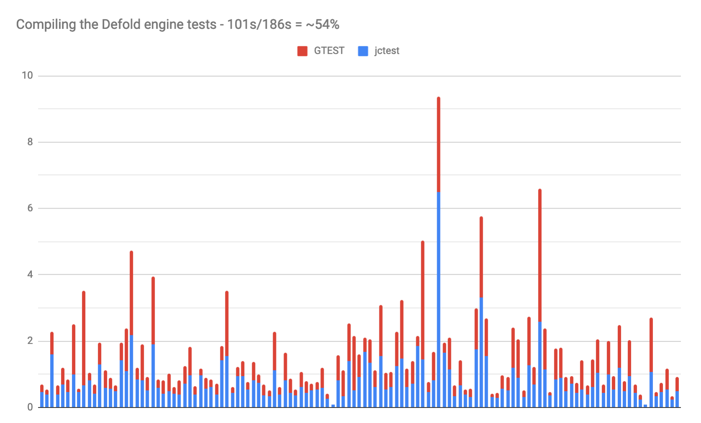
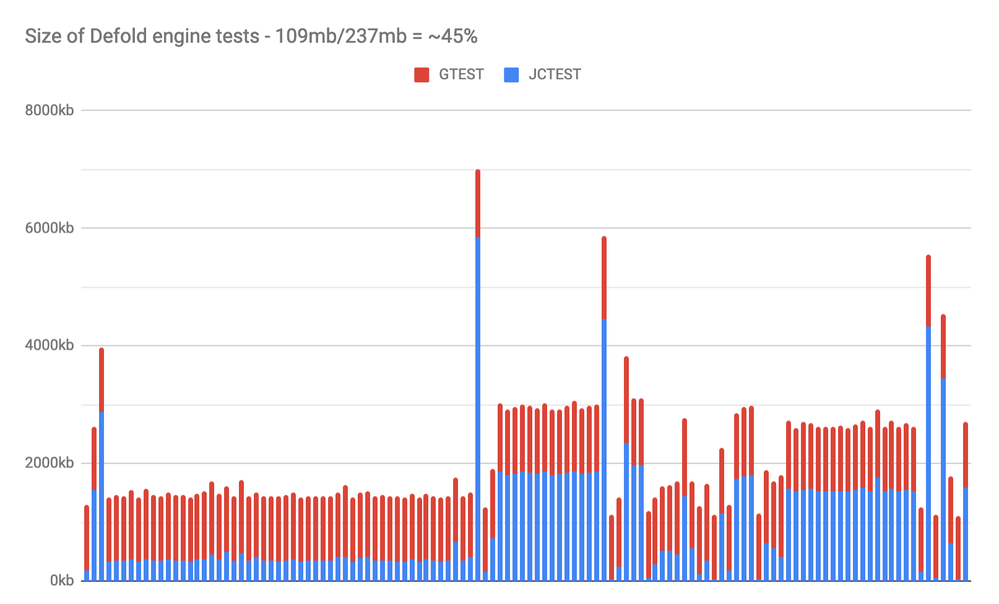

# Benchmarks

## Feature comparisons

| Feature vs Impl        | jc_test |  gtest  | greatest |  utest  | doctest |  catch2 |
|-----------------------:|---------|---------|----------|---------|---------|---------|
| Header only            |   yes   |    no   |    yes   |   yes   |   yes   |   yes   |
| C version              |    -    |    -    |    C89   |   C89   |    -    |    -    |
| C++ version            |  C++98  |  C++11  |     -    |    -    |  C++11  |  C++11  |
| -Wall                  |   yes   |   yes   |    no    |   no    |   yes   |   yes   |
| -Weverything           |   yes   |    no   |    no    |   no    |   yes   |    no   |
| -pedantic              |   yes*  |    no   |    no    |   no    |   yes   |    no   |
| Lines of Code**        |  ~1100  |  10000+ |   <1000  |  <400   |  4000+  |  11000+ |
| Size of program***     |  27292  |  414608 |   19228  |  18280  |  146348 |  829572 |
| Compile time***        |  227ms  |  600ms  |   141ms  |   86ms  |  1890ms | 10662ms |
| Run time***            |    3ms  |    3ms  |    6ms   |    5ms  |    3ms  |   4ms   |


1. * Needs -Wno-global-constructors
1. ** Counting code lines in C/C++ files using cloc
1. *** A minimal test example. "clang++ -O2". Picking the fastest time.

### Minimal test example

A minimal test example was written specifically for each framework.
You can find them in the [jctest/test/comparisons](https://github.com/JCash/jctest/tree/master/test/comparisons) folder.

Comparisons are done using no configurations of the testing framework.
Also, since the goal was to eliminate a precompiled library, the header only version was chosen where available.

```cpp
TEST(MyTest, Multiply) {
    ASSERT_EQ(4, 2*2);
}

TEST(MyTest, Division) {
    ASSERT_EQ(2, 4/2);
}

int main(int argc, char *argv[])
{
    jc_test_init(&argc, argv);
    return jc_test_run_all();
}
```

## Real life examples

Here's a comparison between the two test frameworks when building the Defold game engine tests.
We see a decrease of the compile time, ending up at ~54% of the original time.



The footprint on disc is also important, as it takes up both space but also affects writing/reading times.
In this scenario the file sizes ended up at ~45% of the original sizes.



