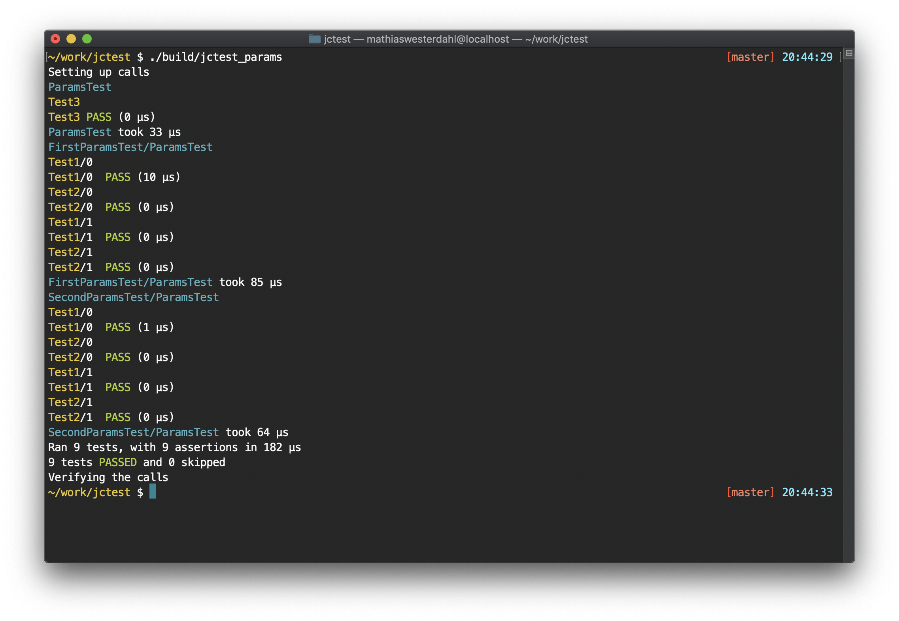

# jctest

A C++ single header only test library implementing a GTEST-like API.
The library was build as a lightweight replacement for googletest.

## Example usage



```c++
#define JC_TEST_IMPLEMENTATION
#include <jc_test.h>

TEST(MyTest, Multiplication) {
    ASSERT_EQ(4, 2 * 2);
}
TEST(MyTest, Division) {
    ASSERT_EQ(2, 4 / 2);
}

int main(int argc, char *argv[]) {
    jc_test_init(&argc, argv);
    // ... Do your test initialization
    return jc_test_run_all();
}
```

```bash
# Compile the test
$ clang++ -Isrc ./examples/test_example.cpp

# Run the test
$ ./a.out
```

You can find more examples in the [API documentation](./README_API.md) and also under the ./test/ folder

## API

See [test cases](./testcases.md) and [test assertions](./assertions.md)

## Goals

* Replacement for googletest, with minimal changes
* Support a few use cases: TEST, TEST_F, TEST_P, TYPED_TEST, (See API)
* As few templates as possible
* As few lines as possible
* Single header only library

From this, the expected result is:

* Fast compile times
* Small executable size
* Less cross compiling for all platforms

## Benchmarks

[Benchmarks](./benchmarks.md)

